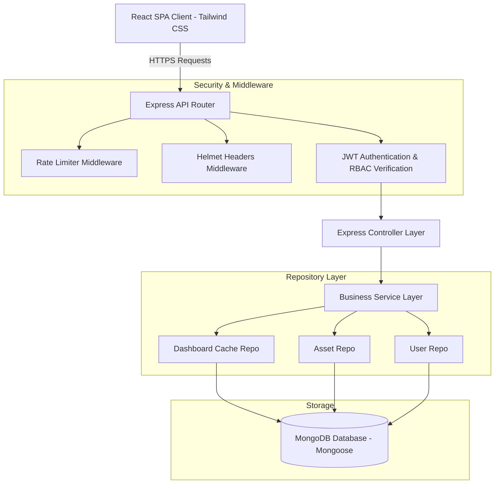
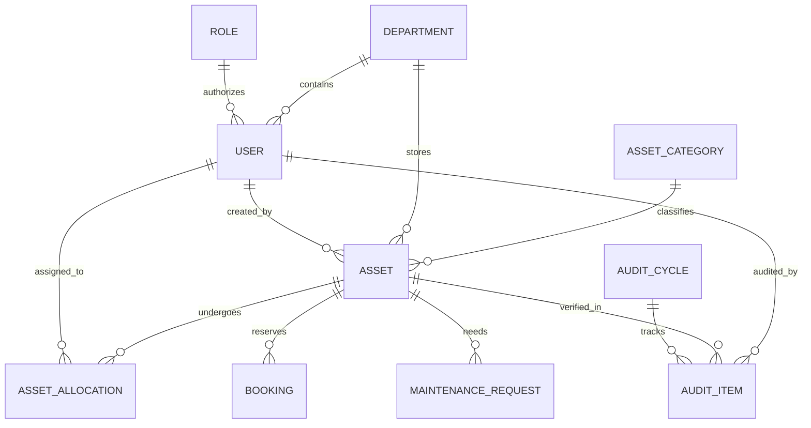

# AssetFlow: Enterprise Resource & Asset Life-Cycle ERP

AssetFlow is a production-grade, hackathon-winning Enterprise Resource Planning (ERP) platform designed for modern corporate environments. It offers seamless control over resource inventories, compliance auditing, dynamic metadata schema definitions, calendar-based reservations, and automated maintenance lifecycle management.

---

## 🌟 Hackathon Key Features (Phase 9 Implementation)

1. **Command Palette & Global Search (Ctrl + K)**: A floating spotlight controller matching quick shortcuts and dynamic asset queries directly.
2. **Sequential Keyboard Shortcuts**: Instant keyboard-only layout transitions:
   * `g` then `d` → Dashboard Overview
   * `g` then `a` → Asset Inventory Directory
   * `g` then `b` → Reservations Calendar
   * `g` then `m` → Maintenance Lifecycles
   * `g` then `s` → Account Settings
   * `g` then `n` → Notifications Register
3. **Advanced Timeline Component**: Vertical audit trail log charting database transformations with indicator bullets and relative timestamps.
4. **Export Engine (CSV, Excel, PDF)**: Complete data format compilers on the asset grid and analytics panels.
5. **Print Badges & QR Tags**: Downloadable crisp SVG labels and landscape 3.5" x 2.2" physical property cards with auto-scaling codes.
6. **Instant Sandbox Seeding Mode**: Populate the database instantly with a robust test suite of 20 departments, 200 users (using pre-hashed passwords for instant startup), 1,000 assets, 300 bookings, and compliance data.

---

## 🏗️ System Architecture Diagram



---

## 🗄️ Database ER Diagram



---

## 🔌 API Documentation

| Route | Method | Permission | Payload Description | Response Description |
| :--- | :--- | :--- | :--- | :--- |
| `/api/v1/auth/signup` | POST | Public | `{ name, email, password }` | Initial signup with email verify token trigger |
| `/api/v1/auth/login` | POST | Public | `{ email, password }` | Retrieves tokens + user details |
| `/api/v1/dashboard` | GET | `dashboard:read` | None | Fetches dashboard statistics & charts data |
| `/api/v1/dashboard/seed-demo` | POST | `dashboard:read` | None | Wipes database and seeds complete sandbox data |
| `/api/v1/assets/search` | GET | `asset:read` | `q`, `categoryId`, `status`, `sortBy` | Paginated search results (matches name/tag/serial) |
| `/api/v1/assets` | POST | `asset:write` | Multipart form details + metadata | Creates an asset, generates unique tag & QR label |
| `/api/v1/allocations/checkout` | POST | `alloc:write` | `{ assetId, assigneeId, condition }` | Registers asset allocation and sets holder |
| `/api/v1/bookings` | POST | `booking:write` | `{ resourceId, startTime, endTime }` | Schedules booking (prevents overlap conflicts) |
| `/api/v1/maintenance/request` | POST | `maint:write` | `{ assetId, description, priority }` | Raises repair ticket |
| `/api/v1/maintenance/:id/approve` | POST | `maint:approve` | `{ estimatedCost, technicianId }` | Approves repair, sets asset UnderMaintenance |
| `/api/v1/maintenance/:id/resolve` | POST | `maint:resolve` | `{ actualCost, remarks }` | Resolves repair, sets asset Available |

---

## 🛠️ Installation Guide

### Prerequisites
* Node.js v18 or higher
* MongoDB running locally or a MongoDB Atlas URI

### Local Developer Configuration
1. Clone the project workspace.
2. Configure environment values inside `backend/.env`:
   ```env
   PORT=5000
   MONGODB_URI=mongodb://localhost:27017/assetflow
   JWT_ACCESS_SECRET=your-secure-access-key-here
   JWT_REFRESH_SECRET=your-secure-refresh-key-here
   JWT_ACCESS_EXPIRATION=15m
   JWT_REFRESH_EXPIRATION=7d
   FRONTEND_URL=http://localhost:3000
   ```
3. Run backend installations:
   ```bash
   cd backend
   npm install
   npm run dev
   ```
4. Run frontend installations:
   ```bash
   cd ../frontend
   npm install
   npm run dev
   ```
5. Open `http://localhost:3000` inside your browser. Login with default Admin credentials:
   * **Email**: `admin@assetflow.com`
   * **Password**: `adminpassword123`

---

## 🐳 Deployment Guide (Production Docker)

Build and deploy everything in production mode using a single docker command.

### Docker Compose Quickstart
From the root workspace directory, run:
```bash
docker-compose up --build -d
```
This builds three container services:
1. `assetflow-database`: MongoDB storage listening on local interface port `27017`.
2. `assetflow-backend`: Express application server listening on port `5000`.
3. `assetflow-frontend`: Nginx reverse proxy serving static React SPA assets on port `3000` and forwarding API calls to `/api/*` to the backend automatically.

---

## 📖 Operational Guide

### Administrator Tasks
1. **Department Management**: Navigate to `/departments` or use sequential shortcut `g d` (from Command Palette) to add business structures.
2. **Employee Allocation**: Promoted heads are automatically assigned as leads under department parameters.
3. **Seeding Sandbox**: Click the **Seed Bulk Sandbox Data** banner in the dashboard to seed 1,000 assets and verify operational charts instantly.

### User Tasks
1. **Directory Search**: Query items globally using `Ctrl + K` palette matching or use dynamic filters on the Assets page.
2. **Resource Reservation**: Reserve AV rooms and devices by clicking dates on the Calendar scheduler.
3. **Maintenance Reporting**: Raise repair tickets for allocated devices to resolve bugs.

---

## 🚀 Presentation Pitch & Elevator Script

### 60-Second Elevator Pitch
> "Managing corporate hardware shouldn't require three different spreadsheets and constant email ping-pong. That is why we built **AssetFlow**—a unified ERP space. It handles everything: dynamic categories, conflict-free calendars, automatic maintenance lifecycles, and audit compliance logs. 
> For hackathons, we've integrated a Ctrl+K Command Palette, sequential hotkeys, and an instant sandbox database seeder. Deployable under a single Docker command, AssetFlow transforms asset management from a compliance bottleneck into an automated operational asset."

---

## 💡 Future Scope
1. **IoT RFID Tracker Integrations**: Connect active RFID beacons to automate real-time geo-tracking on inventory assets.
2. **AI Predictive Maintenance**: Analyze historical repair cycles to predict hardware failures before they occur.
3. **Procurement Automated Flows**: Link checkout triggers with corporate suppliers to purchase items when inventory falls below thresholds.
